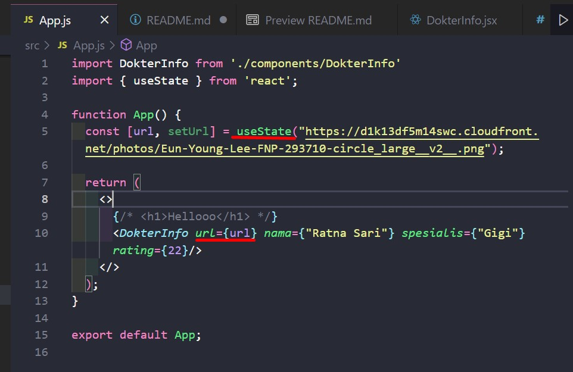
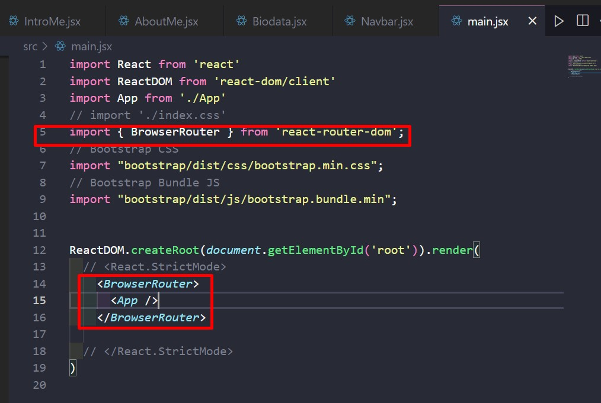
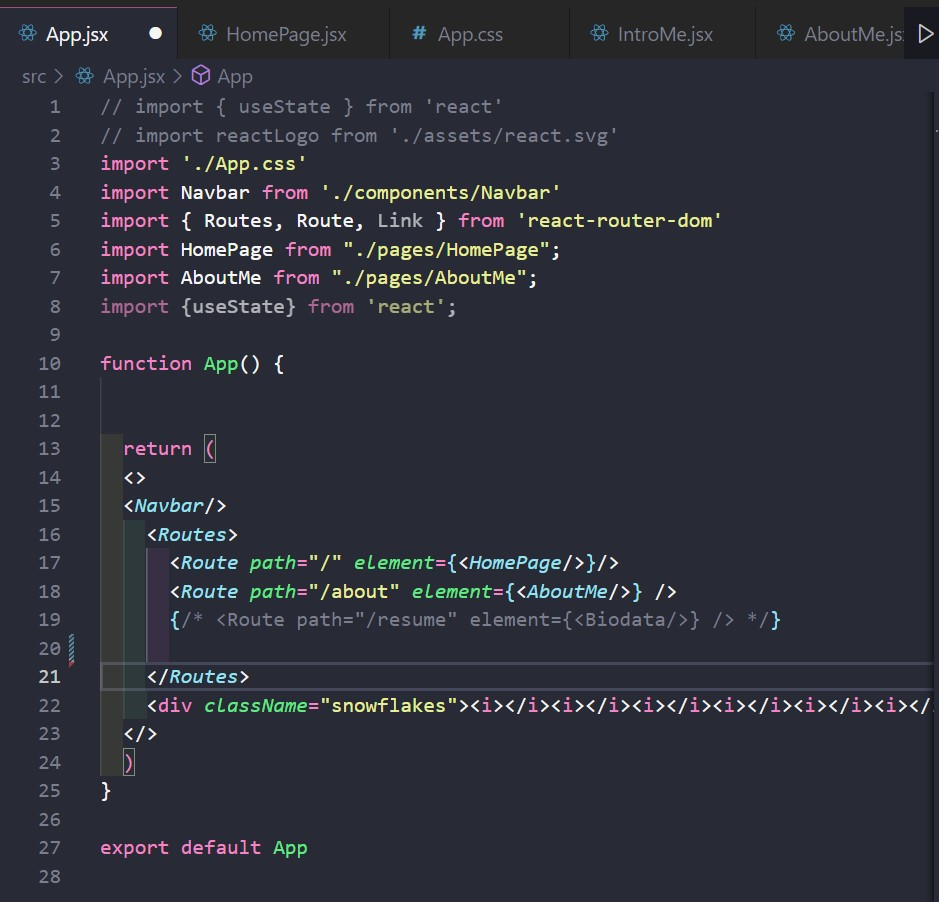
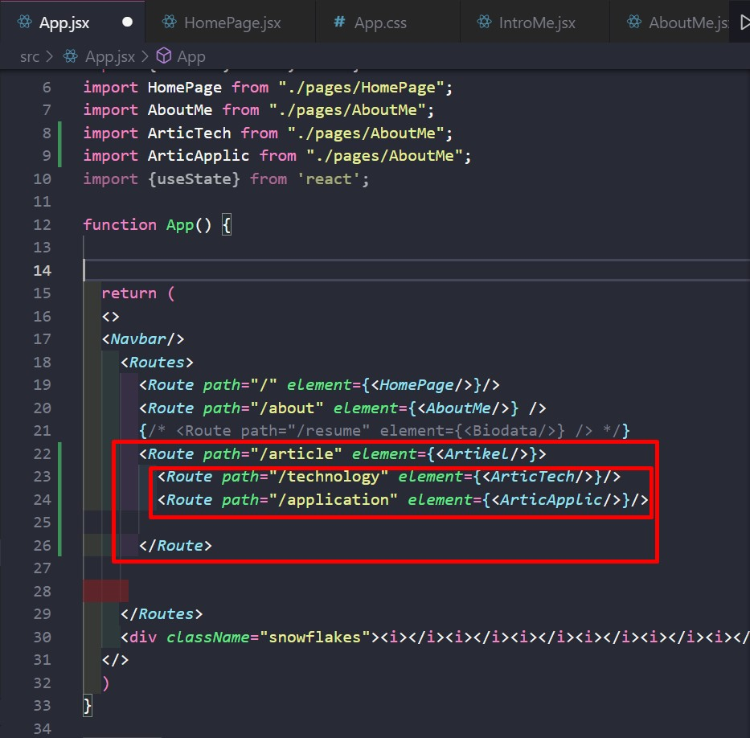

# Writing and Presentation Test Week 7 [31 okt s/d 4 nov]
## <h4>Nama     : Vania Sasikirana</h4><h4></h4>Group FE 2 - Kelompok 11</h4> <h4>Mentor : Thoriq Nur Faizal</h4>

<br>
<br>


### **1. Hooks**
<br><b>Hooks</b><hr>
  
Merupakan sebuah fungsi pada Javascript yang sepaket dengan penggunaan State, setiap sintaks yang awalannya ada use- merupakan sebuah Hooks.<br><br>
<b>Contoh : </b><hr><br>
<br>



### **2. PropTypes**

<br><b>PropTypes</b><hr>
  
Merupakan sebuah library yang berfungsi untuk memvalidasi sebuah props, penggunaan PropTypes ini untuk menjaga props agar tidak error. Jika tipe data pada props tidak sesuai maka nanti akan muncul warning di console browser.<br><br>

<b>Contoh : </b><hr><br>
<br>


```
  new component : DokterInfo.jsx

        import PropTypes from "prop-types";
    const DokterInfo = ({nama, spesialis, rating}) => {
        return(
            <div className="profil">
                  
                <div>
                    <h4>Nama Dokter : {nama}</h4>
                    <p>Spesialis Khusus : {spesialis}</p>
                    <p>Rate : {rating + 2}</p>
                </div>
            </div>
        )

    }
    DokterInfo.prototype = {
        nama: PropTypes.string,
        spesialis: PropTypes.string,
        rating: PropTypes.number,
    } 


    export default DokterInfo;
    
```

```
file App.jsx : 

import DokterInfo from './components/DokterInfo'

function App() {
  return (
    <>
      {/* <h1>Hellooo</h1> */}
      <DokterInfo nama={"Ratna Sari"} spesialis={"Gigi"} rating={22}/>
    </>
  );
}

export default App;

```

<br><br>


### **3. React Router**
<br><b>Router</b><hr>
  
Berfungsi untuk menghubungkan link/path halaman web, namun tidak merubah/refresh link webnya. <br><br>
<b>Contoh : </b><hr><br>
Pertama kita harus memasang library di file main.jsx dulu untuk membuat BrowserRouter.<br>
<br>
Kemudian kita buat lagi deh Routes nya di dalam App.jsx
<br>
<br>
Nah nanti hasilnya jika di klik akan mengarah ke halaman yang sudah di deklarasikan.<br>
<br><br>
Kita juga dapat membuat nested route agar penggunaan route menjadi lebih efisien lagi.<br>
<br><br>

### **4. Redux**
<br><b>Redux</b><hr>
  
Berfungsi untuk memperpendek jalur pemberian props ke komponen yang lainnya, jadi ga perlu oper-oper tiap komponen, melainkan kita bisa langsung oper ke komponen yang membutuhkan saja. <br><br>
<b>Contoh : </b><hr><br>
Pertama kita harus memasang library di file main.jsx dulu untuk membuat BrowserRouter.<br>
<br>
Kemudian kita buat lagi deh Routes nya di dalam App.jsx
<br>
<br>
Nah nanti hasilnya jika di klik akan mengarah ke halaman yang sudah di deklarasikan.<br>